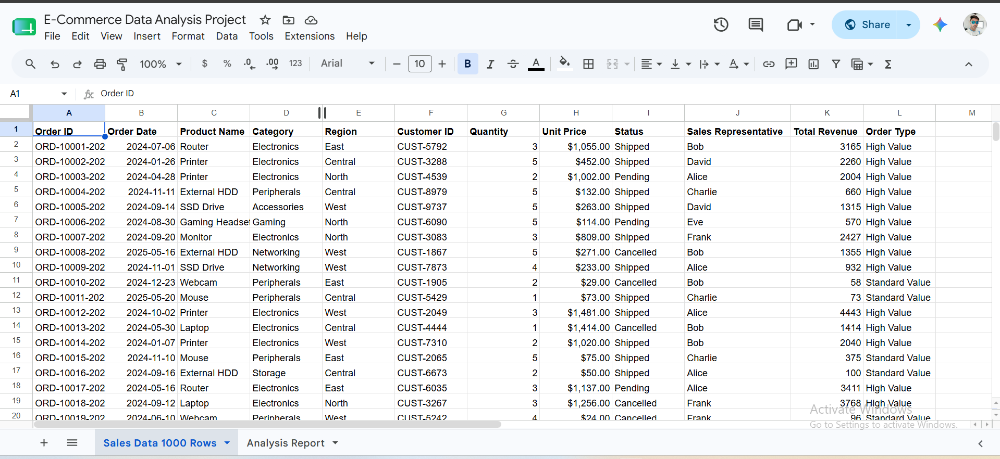
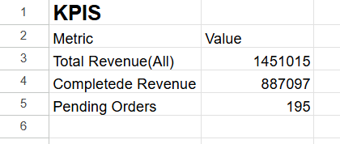
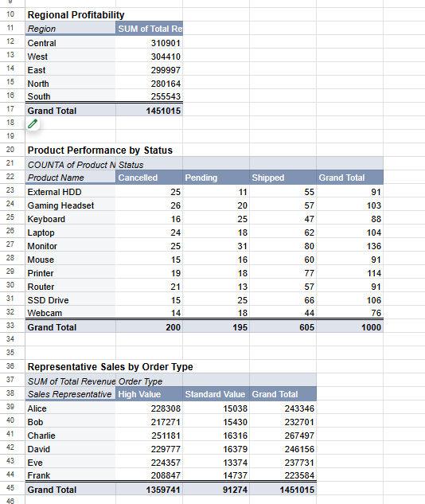
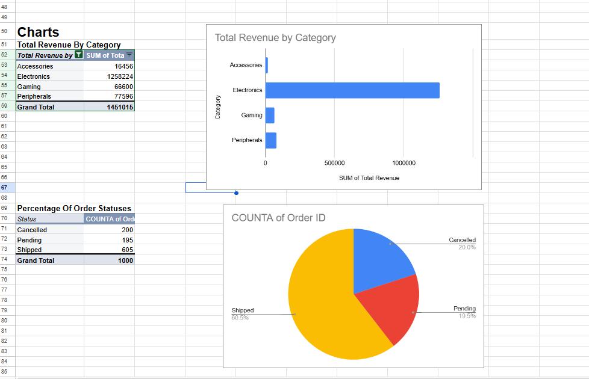

# 🛒 E-Commerce Data Analysis Project

## 📌 Project Overview

This project analyzes an E-Commerce Sales dataset using **Google Sheets**, **Pivot Tables**, **Pivot Charts**, and **Data Cleaning** techniques. The objective is to identify sales trends, customer behavior, product performance, and business insights.

---

## 📂 Dataset

- Dataset: E-Commerce Sales Data
- Records: 1000 Orders
- Format: CSV
- Tool Used: Google Sheets

---

## 🛠️ Tools & Skills Used

- Google Sheets
- Data Cleaning
- Pivot Tables
- Pivot Charts
- KPI Dashboard
- Data Visualization
- GitHub

---

## 📊 Key Performance Indicators (KPIs)

| KPI | Value |
|------|-------|
| Total Revenue | 1,451,015 |
| Completed Revenue | 887,097 |
| Pending Orders | 195 |

---

## 📈 Analysis Performed

- Regional Profitability Analysis
- Product Performance by Order Status
- Sales Representative Performance
- Revenue by Product Category
- Order Status Distribution
- KPI Dashboard Creation
- Pivot Tables & Pivot Charts

---

## 📸 Project Screenshots

### Cleaned Dataset



---

### KPI Dashboard



---

### Data Summary using Pivot Tables



---

### Data Visualization



---

## 📁 Repository Structure

```
ecommerce-data-analysis/
│
├── sales_data.csv
├── README.md
└── screenshots/
    ├── clean_data.png
    ├── kpis.png
    ├── data_summarization.png
    └── visualisation.png
```

---

## 💡 Key Insights

- Electronics category generated the highest revenue.
- Most orders were successfully shipped.
- Regional sales performance varied significantly.
- Sales representatives contributed differently across order types.
- Pivot Tables helped summarize business performance effectively.

---

## 👨‍💻 Author

**Pranav Prasoon**

Aspiring Data Analyst

Skills:
- Google Sheets
- SQL
- Power BI
- Python
- Excel

GitHub:
https://github.com/PRANAVPRASON
